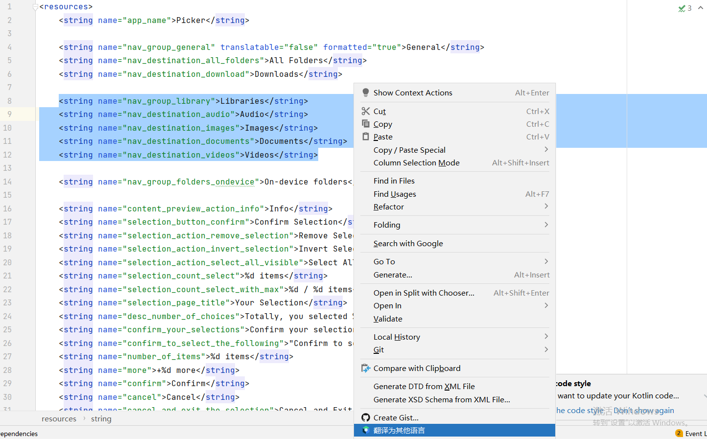
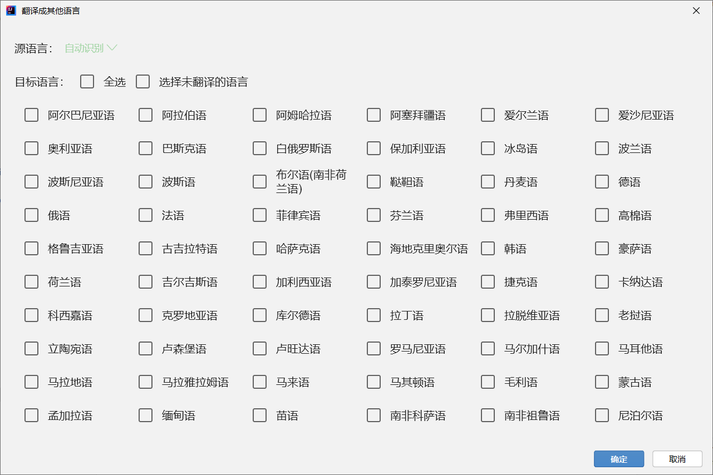

# GlobalizationTranslator

[英语](README.md)

Intellij平台i18n插件，一键自动为您的应用翻译131种语言，支持Android strings.xml和java.properties文件

本插件支持翻译 Android.xml 和 java .properties 文件，可以保留占位符如```%1$s```, ```%2$d```, ```{0}```,```{1}``` 并且可以保留转义字符，例如 ```\n```,```\"```,```\'```, 等等, 支持 ```string```, ```string-array```, ```plurals``` 标签.

本插件相对于其他插件的优势：翻译速度快，不到两分钟将文件翻译成131种语言，支持保留占位符，支持增量翻译。

<h2>安装</h2>

~~Intellij平台 -> 设置(Settings) -> 插件(Plugins) -> 市场(Marketplace) -> 搜索 "GlobalizationTranslator" -> 安装(Install)~~（插件正在审核中）

从这里下载 GlobalizationTranslator.zip : [release](https://github.com/wilinz/globalization-translator/releases) -> 设置(Settings) -> 插件(Plugins) -> 单击设置按钮  -> 从磁盘安装插件(Install Plugin form Disk)

依赖：<a href="https://plugins.jetbrains.com/plugin/18439-compose-for-ide-plugin-development-experimental-">Compose for IDE Plugin Development (Experimental)</a>
<h4>下载依赖:</h4>

<ul>
    <li>
        <h4>
            Intellij 版本 >= 213:
        </h4>
        设置(Settings) -> 插件(Plugins) -> 市场(Marketplace) -> 搜索 "Compose for IDE Plugin Development (Experimental)" -> 安装(Install)
    </li>
    <li>
        <h4>
            Intellij 版本 < 213:
        </h4>
        <a href="https://github.com/wilinz/globalization-translator/releases/download/1.0.0/Compose_Intellij_Plugin_Base-0.1.0.zip">点击这里下载依赖库</a>
        -> 设置(Settings) -> 插件(Plugins) -> 单击设置按钮  -> 从磁盘安装插件(Install Plugin form Disk)
    </li>
</ul>

<h2>用法:</h2>
<h3>1. 翻译整个文档</h3>
<ol>
    <li>选择 values/strings.xml 或 .properties 文件</li>
    <li>右键单击并选择“翻译此文件”。</li>
    <li>选择要翻译的语言。</li>
    <li>单击确定。</li>
</ol>
<h3>2. 增量翻译</h3>
<ol>
    <li>在 values/strings.xml 或 .properties 文件中, 选择 n 行要翻译的内容</li>
    <li>右键单击并选择“翻译成其他语言”。</li>
    <li>选择要翻译的语言。</li>
    <li>单击确定。</li>
</ol>

## 技巧
翻译 Android strings.xml 后，会生成很多个 values-** 文件夹，导致非常混乱，这时我们可以在 app/main 目录下新建一个文件夹，随意命名，如 res-i18n ,
然后在 res-i18n 目录下新建 values 目录，再把之前 res/value/strings.xml 拷贝到 values 目录下
然后编辑 build.gradle , 在 sourceSets/main 下面加入 res.srcDirs += "src/main/res-i18n", 其中 res-i18n 是刚才新建文件夹的名称，再点击gradle sync就可以了，
之后翻译生成的文件都在 res-i18n 目录下，看起来清爽了不少
```gradle
android {
    //...
    sourceSets {
        main {
            res.srcDirs += "src/main/res-i18n"
        }
    }
}
```

## 注意
请注意正确选择源语言，否则翻译可能不太准确

1.对于 Android strings.xml , 不翻译的字符串请加 translatable="false", 
如 
```xml
<string name="test" translatable="false">Test</string>
```
2.对于.properties 文件，不翻译的字符串和翻译的字符串请分文件存放

## 支持
https://github.com/wilinz/Sponsor

## 开发：
在终端运行命令运行插件: `./gradlew runIde`




